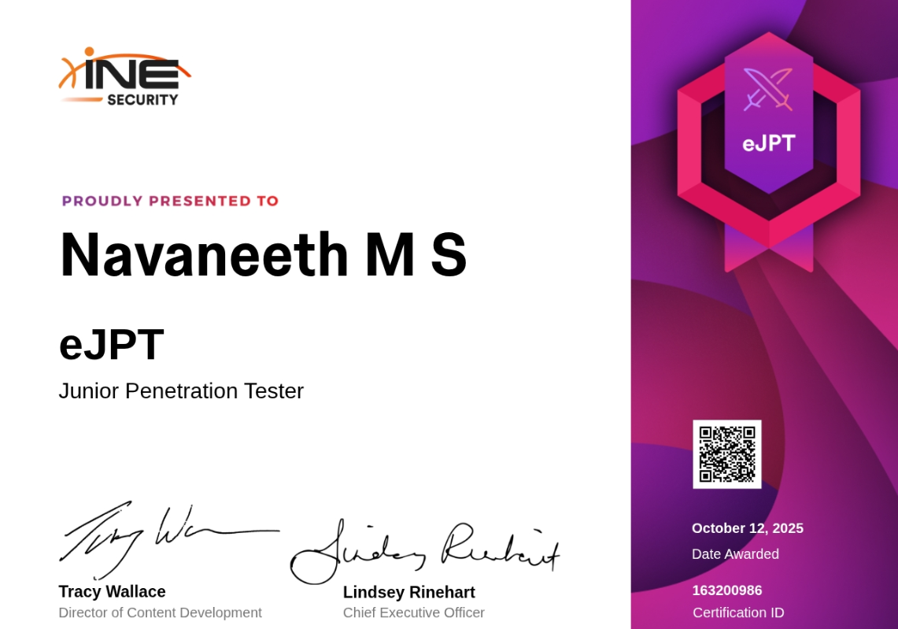

Hi, I’m **Navaneeth**, a **20-year-old Cyber Forensics student**.

In this post, I’ll be sharing my journey to successfully completing the **eJPT (eLearnSecurity Junior Penetration Tester)** exam. There are many write-ups available online, but this one is different — I am writing this on the **same day I completed the exam**, so everything is still fresh in my mind.

This post will be long, but if you are preparing for the eJPT or want to know what the exam _really_ feels like, it’s worth reading.

---

## 🟦 What is the eJPT Exam?

The **eJPT** (Junior Penetration Tester) is an entry-level penetration testing certification designed for beginners with a basic understanding of networks and systems.

It focuses on real-world pentesting scenarios, covering:

- Assessment Methodologies
- Host & Network Auditing
- Penetration Testing
- Web Application Testing

### **📌 Exam Information**

- **Questions:** 35 (including flags)
- **Passing Score:** 70% (25/35)
- **Exam Type:** Open-book
- **Delivery:** Online, start any time
- **Duration:** 48 hours
- **Report:** Not required — just answer questions and provide flags

---

## 🟦 My Story

I purchased the eJPT exam vouchers on **August 17, 2025**, during an offer, for **$125**. This included:

- 3 months of **eJPT Fundamentals**
- 2 exam vouchers

With college going on, I managed to set aside just **1.5 hours per day** initially. But during my study leave, I pushed myself to complete the entire learning material.

I completed the **first 30%** of the learning path in **40 days**, and the remaining **70%** in just **1 week** — with some days having **10+ hour sessions**.  
The course includes:

- Video content
- MCQs
- Labs
- A CTF

### ✔️ The Best Decision I Made

I spent the last **2 days only on labs**. That helped more than anything else.

---

## 🟦 My Preparation Method

While studying, I created **structured lecture notes** with important commands. This helped way more than Googling or using cheat sheets.

My advice to you:

### 🔹 **1. Complete the modules at your own pace**

No need to rush the videos.

### 🔹 **2. DON’T read lab walkthroughs**

Solve labs and the CTF yourself. It will take time, but it is worth it.

### 🔹 **3. Practice labs more than watching videos**

Hands-on experience matters the most.

### 🔹 **4. Enumeration is the key**

Spend time understanding how to enumerate properly. This will help you not only in this exam but also in real pentesting.

---

## 🟦 My Exam Approach

I started the exam at **8 PM**.

INE provides a **browser-based Kali machine** connected to the target environment. It takes about 5 minutes to load.

Here’s how I approached the exam:

### ✔️ I answered the first 6–8 questions in around 2 hours.

If I didn’t know an answer, I flagged it and moved on.

### ✔️ I used both Notion and a notebook.

For every host I found, I dedicated **one full page** to it — writing its IP, hostname, and all steps.

This helped a lot.

---

## 🟥 The Biggest Mistake I Made

I focused only on the **current question** and didn’t read ahead.

This wasted time and made me stuck for hours. The lab gives no hints — but the **questions themselves DO**.

After taking a break (coffee), I came back and read all the questions properly.

Everything became clearer after that.

---

## 🟦 Important Tips for the Exam

### ✔️ **Read ALL the questions first**

They contain hidden hints.

### ✔️ **Don’t overthink — it’s a beginner exam**

Stick to basics.

### ✔️ **Be patient**

You have 48 hours. Rest if needed.

### ✔️ **Use the right wordlists**

Common Unix passwords, default password lists, etc.

### ✔️ **Privilege escalation**

Know the basics for both Windows and Linux.

### ✔️ **Take breaks**

It helps. I did it multiple times.

---

## 🟦 The Lab Environment (Spoiler-Free)

Here’s what you can expect, _without revealing exam content_:

- You must **find the hosts** — no IPs are provided
- Enumeration is crucial
- There are both **Linux and Windows machines**
- You will need to find vulnerabilities and exploit them
- Privilege escalation is required
- You may need to crack hashes
- The correct wordlists are important
- The questions offer hints — pay attention to them

This is the part nobody explained properly in other write-ups, and it’s what will help you pass.

---

## 🟦 Final Words

If you’ve read this far, you now know everything you need to pass the eJPT.

There are cheat sheets online with answers — **don’t trust them**.  
Use your own notes.

I completed the exam in **25 hours**, including breaks, chatting with friends, and my usual routine.

This blog is written for two reasons:

1. To document my own journey
2. To help anyone preparing for the exam

Good luck with your preparation!

**#eJPT #CyberSecurity #PenetrationTesting #InfoSec #EthicalHacking #Certification #eJPTexperience**
