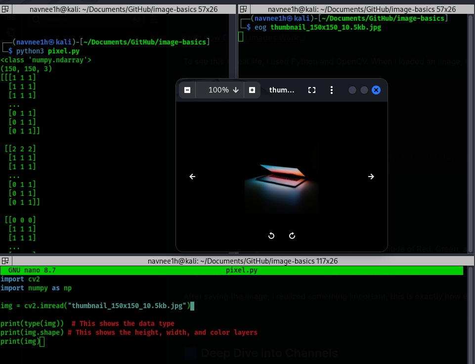
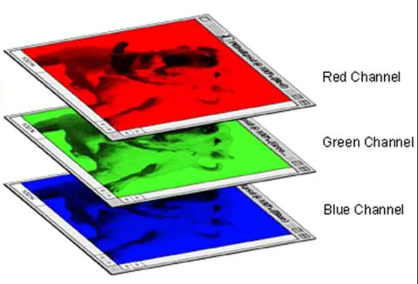
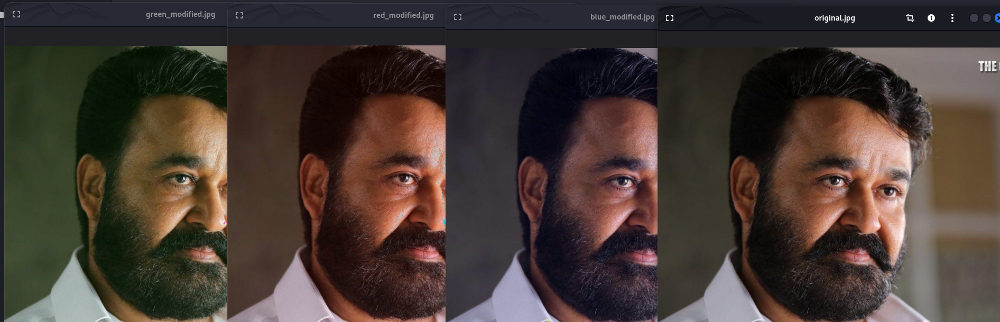
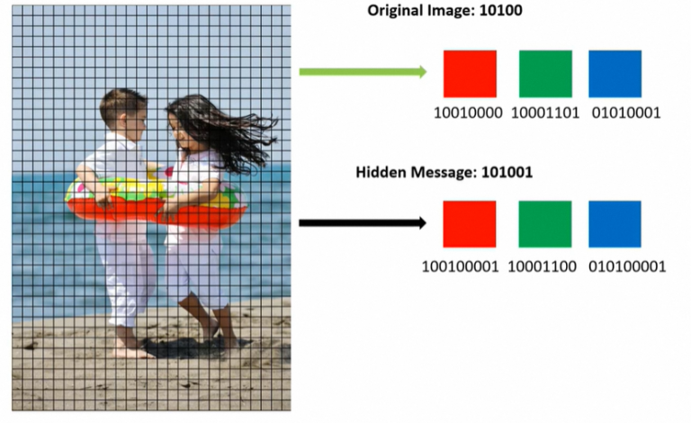

Hi, I’m **Navaneeth**, a 20 years old Cyber Forensics student.

My ultimate goal is to study about the invisible watermark for media. 

Today, I finally started that journey by learning the basics of image processing. I am writing this at **10:30 PM** from [Tinkerspace, Kochi](https://tinkerhub.org/tinkerspace) and I want to exactly what I studied today.


---

# How Images are Made

I started with the most basic question, How are images actually made? I watched some videos to understand that computers don't see colors, they only see numbers.




To see this in real life, I used Python and OpenCV. When I loaded an image, the code showed me that a picture is just a giant grid of numbers.

```python
import cv2
import numpy as np

img = cv2.imread("image.jpg") 

print(type(img))  # This shows the data type
print(img.shape) # This shows the height, width, and color layers
```

---

## Modifying Pixels and RGB

I spent time learning about **RGB values**. Every pixel is made of Red, Green, and Blue. I tried to modify the pixels myself with this code:

`img[100, 200] = [0, 0, 255] # Making one pixel pure RED`

After saving the image, I realized something important, **this is exactly how editing software works.** Whether it is Photoshop or a simple filter, they are all just changing pixel numbers.

---

## Deep Dive into Channels

Next, I looked into **channels**. This means separating one image into three different 2D layers.


I learned that humans see colors differently. We are very sensitive to green, but our eyes almost don't notice small changes in the **Blue channel**. I tested this with a photo of a superstar. When I changed the blue values slightly, the image looked exactly the same to my eyes. This is where the theory of **steganography** begins, using those "hidden" spots to tuck away data.


### Human vision sensitivity
Human eyes:
- 👁️ **Most sensitive** → Green
- 👁️ Medium → Red
- 👁️ **Least sensitive** → Blue
    

So if we slightly change:
- Green → very noticeable ❌
- Red → somewhat noticeable ⚠️
- **Blue → almost invisible** ✅

I also tried converting images to **Grayscale**. I compared the **Average method** to the **Luminosity method**. The Luminosity method is much better because it matches how our eyes actually see brightness.

---

## Steganography and LSB

This led me to **steganography**, which is the art of hiding data inside images. I focused on **LSB** (Least Significant Bit).

I found that if you change the very last bit of a number (like changing 255 to 254), the change is invisible to humans. I demonstrated why LSB is better than MSB (Most Significant Bit) using the same superstar image. If you change the MSB, the image breaks, but with LSB, it stays perfect.



I practiced modifying the Blue values to hide data. It works because our vision sensitivity is so low in that channel.

---

## The Big Problem (Why LSB Fails)

Even though LSB is cool, I found its biggest weakness.

The hidden data gets scrambled or deleted if we
- Resize the image.
- Take a screenshot.
- Convert the file from PNG to JPG.

#### That’s why steganography won’t work if the encoded image is created or taken from another device, or if the image is modified. This is why the original image must be sent without any loss.


My ultimate goal is to create an **invisible watermark** that stays there even if someone takes a photo of the screen with a camera. LSB simply cannot do that.

---

## Next Step

Today was just the start. To master this I need to focus on the **frequency domain** of image processing. Instead of changing pixels, I need to look at the math behind the whole image structure.

It’s late here, but I’m excited for tomorrow.

